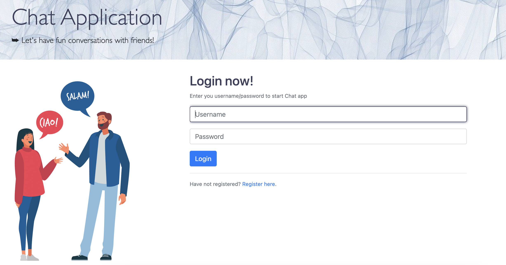
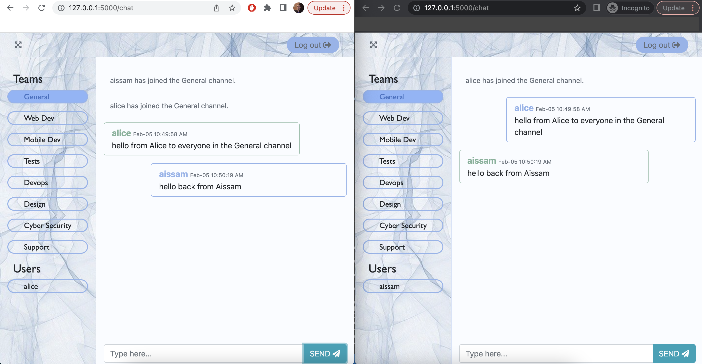
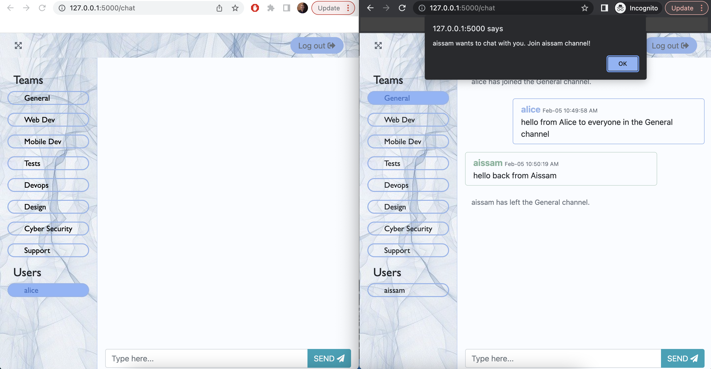
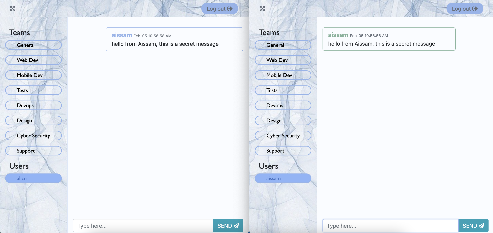

# Chat application with SocketIO

This project is a chat application based on websockets, it supports both private messages and chatrooms. The code also covers the registration and login processes. The database being utilized is Postgres.

  

## Public chatrooms

After registration, user credentials will be stored in the Postgres DB. Check below to see how to setup the project.

Upon login, users are automatically redirected to the Genaral chatroom. They can change rooms, and only users in the same room can see each others' messages.

  

## Private chat

Connected users can be viewed in the "Users" section. To initiate a private chat, simply click on a user and they will receive a notification, allowing you to start the private conversation.

.

