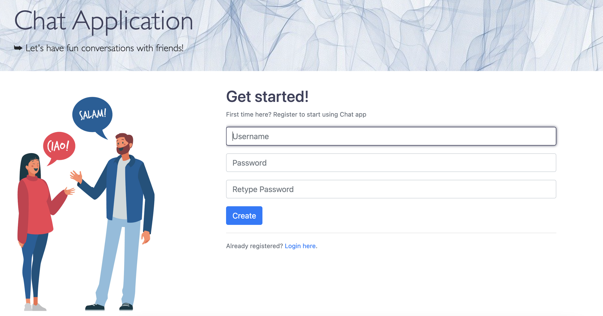

# Chat application with SocketIO

This project is a chat application based on websockets, it supports both private messages and chatrooms. The code also covers the registration and login processes. The database being utilized is Postgres.

  
  

